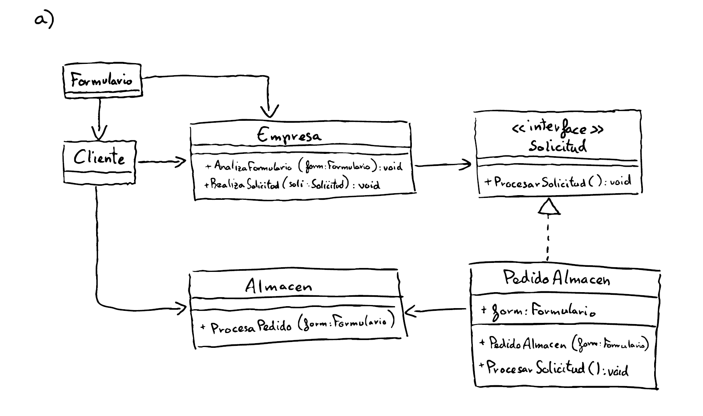
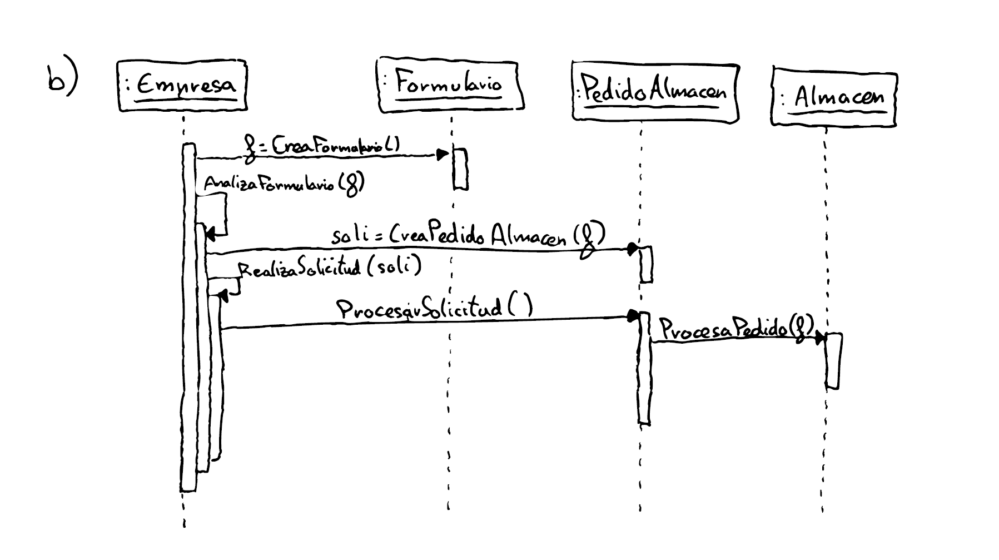
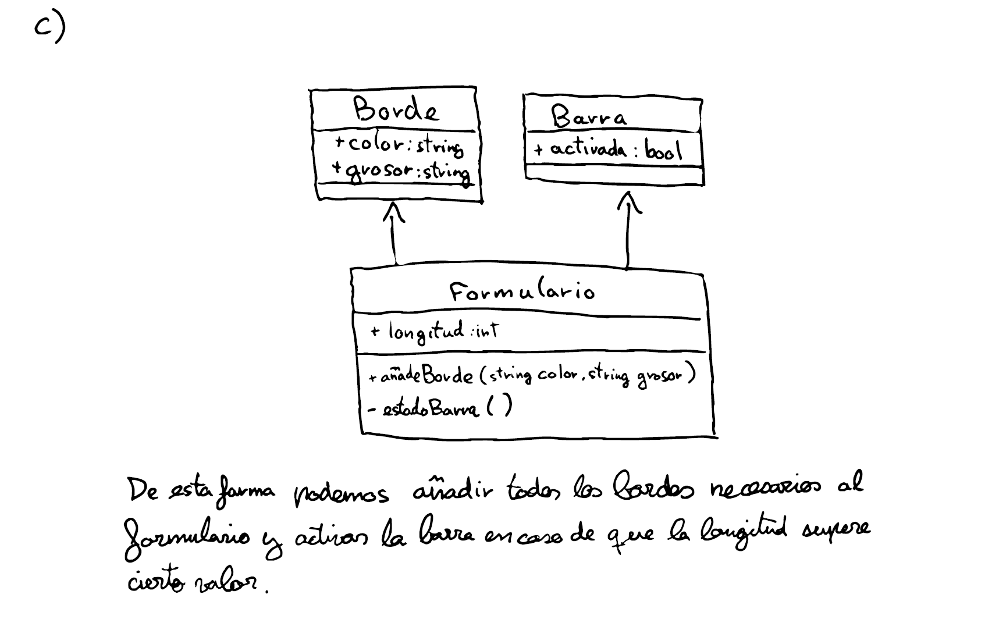

# Ejercicio 3 - Patrones de diseño

## Apartado A)

## Apartado B)

## Apartado C)

### Texto del apartado

De esta forma podemos añadir todos los bordes necesarios al formulario y activar la barra en caso de que la longitud supere cierto valor.